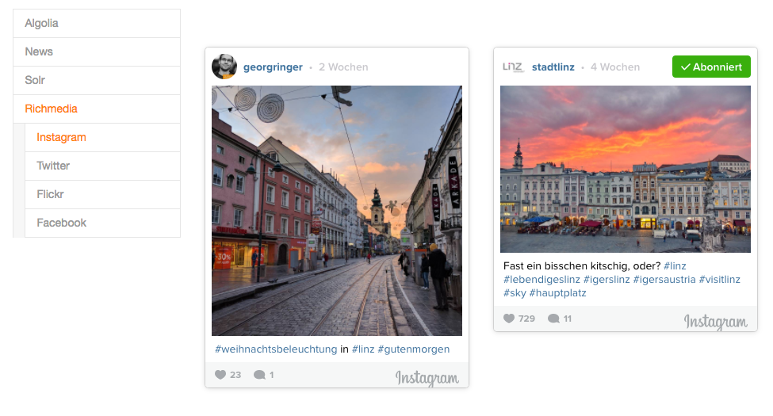

TYPO3 extension `richmedia`
===========================

What is it about?
^^^^^^^^^^^^^^^^^

This extensions provides easy ways to embed content from the following sites:

- Facebook
- Flickr
- Instagram
- Twitter

The usage is similiar to the one of the already available media providers like *youtube** or *vimeo*.

Requirements
------------

- TYPO3 CMS `8.7` or `9.x`
- EXT:fluid_styled_content
- GPL2

Screenshots
-----------

Facebook
""""""""

.. figure:: Documentation/screenshots/facebook.png

Instagram
"""""""""

Twitter
"""""""

Flickr
""""""

Usage
^^^^^

- Install the extension
- Add the new elements

Todo
^^^^

- Cleanup
- Improving the regex
- Testing
- Configuration
- ...
